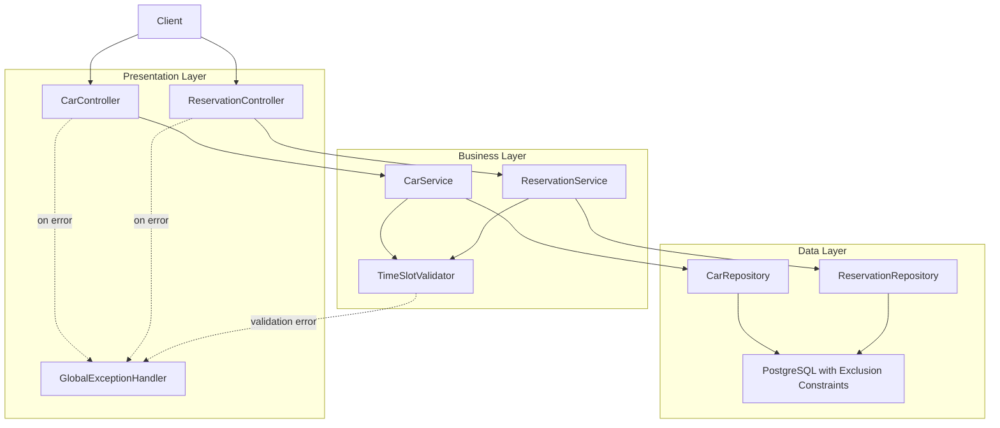

# Car Reservation Service

A Spring Boot application for managing car reservations with robust concurrency control and high-performance capabilities.

## Features

- **Car Management**: Browse and manage a fleet of vehicles with pagination
- **Reservation System**: Create and cancel reservations with duration validation (2-24 hours)
- **Concurrency Control**: PostgreSQL exclusion constraints prevent double-booking
- **Availability Checks**: Query available cars for specific time slots
- **Load Testing**: Gatling performance tests validated for 10,000+ cars
- **Health Monitoring**: Spring Boot Actuator endpoints

## Tech Stack

- **Backend**: Spring Boot 3.5.7, Java 17
- **Database**: PostgreSQL 15 with Flyway migrations
- **Testing**: JUnit 5, Mockito, Gatling 3.13.5
- **Build**: Maven with Scala 2.13.15 support
- **Containerization**: Docker & Docker Compose

## Architecture

The application follows a layered architecture with clear separation of concerns:



- **Controllers**: Handle HTTP requests and responses
- **Services**: Contain business logic and validation
- **Repositories**: Manage data access with JPA
- **Database**: PostgreSQL with exclusion constraints for concurrency control

## Quick Start

### Prerequisites

- Java 17+
- Docker & Docker Compose
- Maven 3.6+

### Docker Deployment

Run the complete stack:

```bash
docker-compose up --build
```

### Local Development

1. **Clone the repository**:
   ```bash
   git clone https://github.com/paullukic/car-reservations-test-java.git
   cd car
   ```

2. **Start PostgreSQL**:
   ```bash
   docker-compose up -d postgres
   ```

3. **Build the application**:
   ```bash
   ./mvnw clean compile
   ```

4. **Run tests**:
   ```bash
   ./mvnw test
   ```

5. **Run the application**:
   ```bash
   ./mvnw spring-boot:run
   ```

   Access at `http://localhost:8080`

For detailed Docker instructions, see [DOCKER-README.md](DOCKER-README.md).

## API Endpoints

| Method | Endpoint | Description | Headers |
|--------|----------|-------------|------|
| GET | `/api/v1/cars?page=0&size=20` | List cars (paginated) | - |
| GET | `/api/v1/cars/available?startTime={ISO8601}&endTime={ISO8601}` | Check available cars | - |
| POST | `/api/v1/reservations` | Create reservation | `X-User-ID: {uuid}` |
| DELETE | `/api/v1/reservations/{id}` | Cancel reservation | `X-User-ID: {uuid}` |

### Example: Create Reservation

```bash
curl -X POST http://localhost:8080/api/v1/reservations \
  -H "Content-Type: application/json" \
  -H "X-User-ID: 123e4567-e89b-12d3-a456-426614174000" \
  -d '{
    "carId": "550e8400-e29b-41d4-a716-446655440000",
    "startTime": "2025-01-20T10:00:00Z",
    "endTime": "2025-01-20T12:00:00Z"
  }'
```

## Load Testing

### Setup for Load Testing

1. **Start the test environment**:
   ```bash
   docker-compose -f docker-compose.test.yml up -d
   ```

2. **Populate the test database with 10,000 cars**:
   ```bash
   ./mvnw test -Dtest=DatabasePopulationTest \
    -Dspring.profiles.active=test \
    -Dspring.datasource.url=jdbc:postgresql://localhost:5433/cardb \
    -Dspring.datasource.username=user \
    -Dspring.datasource.password=password
   ```

3. **Run Gatling load tests**:
   ```bash
   ./mvnw gatling:test
   ```

4. **View results**:
    The terminal output will show the report location
    Open the generated report at `target/gatling/carreservationloadtest-{timestamp}/index.html`

5. **Cleanup test environment**:
   ```bash
   docker-compose -f docker-compose.test.yml down -v
   ```

For detailed load testing information, see [GATLING.md](GATLING.md).

## Database Schema

The application uses PostgreSQL with:

- **Exclusion Constraints**: Prevents overlapping reservations using `btree_gist`
- **Duration Validation**: Check constraints ensure 2-24 hour reservations
- **Indexes**: Optimized queries on `car(make, model)` and `reservation(car_id, start_time)`
- **Sample Data**: 10 pre-loaded cars for testing

See `src/main/resources/db/migration/V1__init_schema.sql` for details.

## Project Structure

```
src/
├── main/
│   ├── java/com/reservation/car/
│   │   ├── config/          # Configuration classes
│   │   ├── controller/      # REST controllers
│   │   ├── dto/             # Data transfer objects
│   │   ├── exception/       # Custom exceptions
│   │   ├── model/           # JPA entities
│   │   ├── repository/      # JPA repositories
│   │   ├── service/         # Business logic
│   │   └── util/            # Utility classes
│   └── resources/
│       ├── db/migration/    # Flyway SQL migrations
│       └── application*.yml # Configuration files
└── test/
    ├── java/                # JUnit tests
    └── scala/               # Gatling load tests
```

## Testing Strategy

- **Unit Tests**: Service and utility layer tests with Mockito
- **Integration Tests**: Full Spring context tests with test containers
- **Chaos Tests**: Concurrent reservation stress tests
- **Load Tests**: Gatling performance tests for scalability validation

Run all tests:
```bash
./mvnw verify
```

## Configuration

### Application Profiles

- **Default** (`application.properties`): Local development
- **Docker** (`application-docker.yml`): Containerized deployment
- **Test** (`application-test.yml`): Test environment

### Key Configuration

- Database: `cardb` / user: `user` / password: `password`
- Server port: `8080`
- Flyway migrations: enabled automatically

## Monitoring & Health Checks

Spring Boot Actuator endpoints:

- Health: `http://localhost:8080/actuator/health`

## Troubleshooting

### Port 8080 already in use
```bash
# Change the port in application.properties
server.port=8081
```

### Database connection errors
```bash
# Ensure PostgreSQL is running
docker-compose ps
docker-compose up -d postgres
```

### Build failures
```bash
# Clean and rebuild
./mvnw clean install
```

For more troubleshooting, see [DOCKER-README.md](DOCKER-README.md).